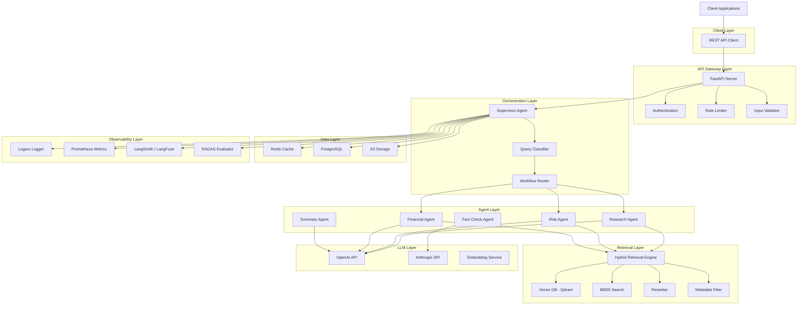
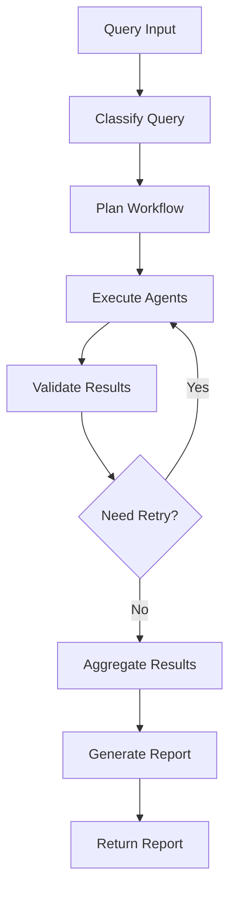
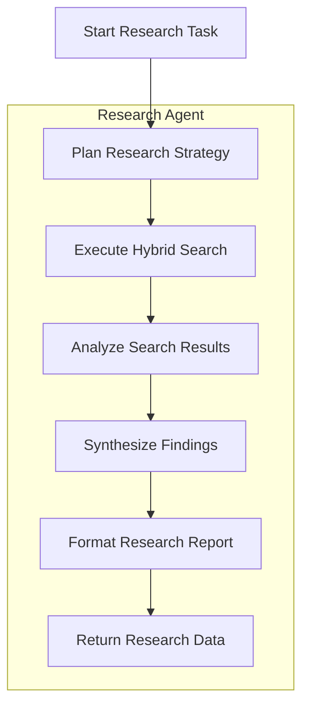
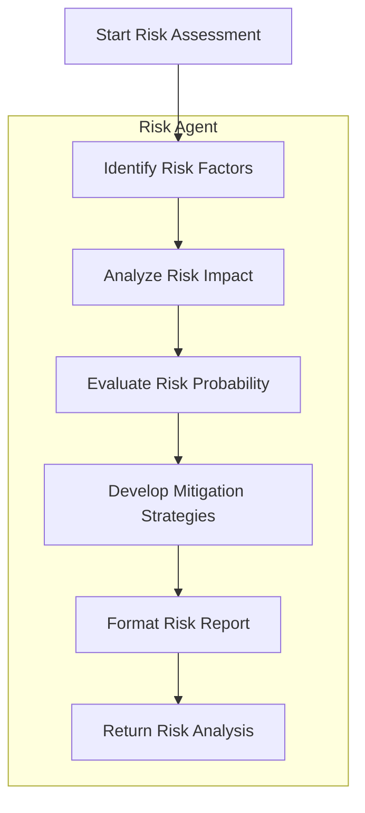
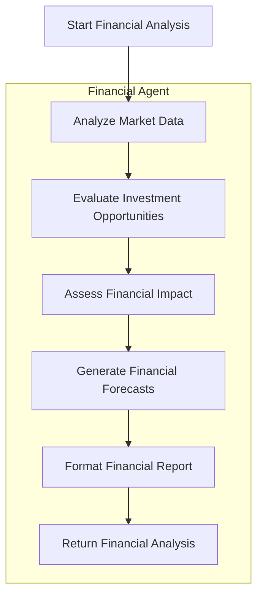
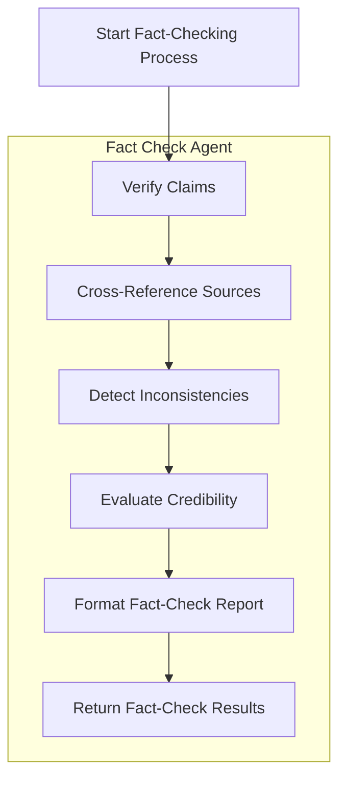
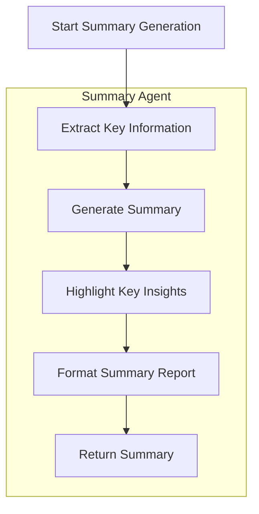
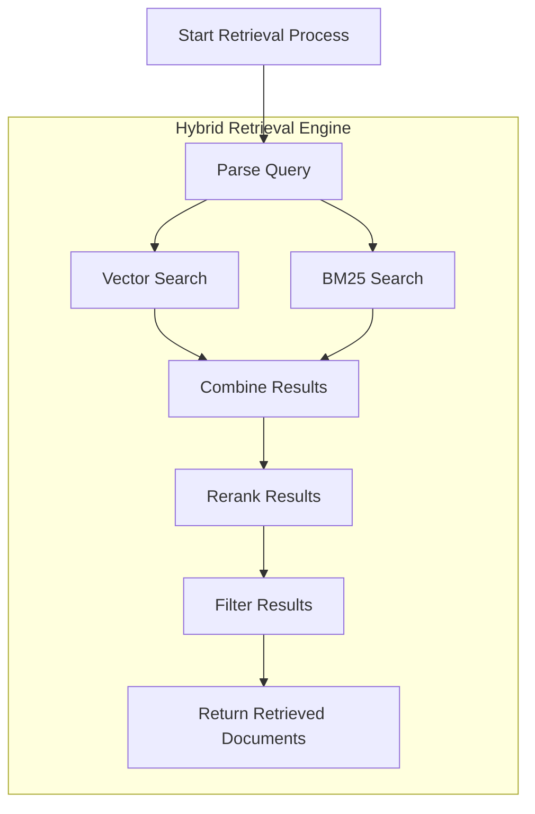
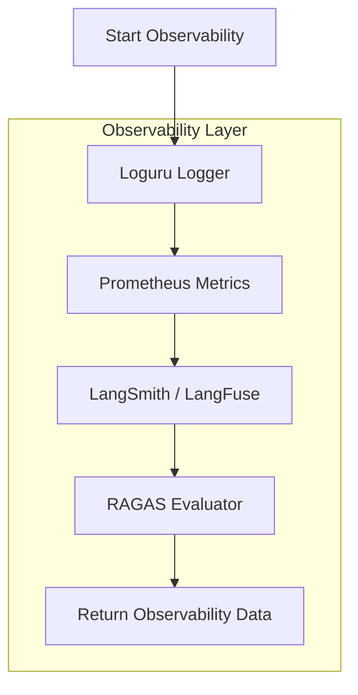
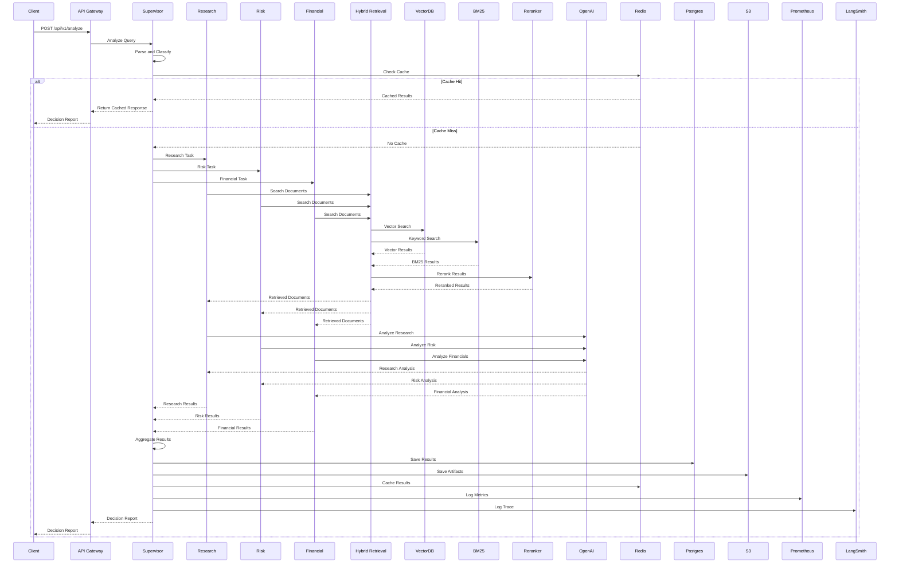

# Multi-Agent Decision Intelligence System – Architecture

---

# 1. System Architecture Overview

# 2. Component Details

## 2.1 Supervisor Agent

The Supervisor Agent is the central orchestrator that manages the entire decision intelligence workflow. It uses LangGraph to create a stateful, multi-agent system that can handle complex business queries.

### Responsibilities

- **Query Understanding**: Analyzes the user's query to determine the intent and required information
- **Workflow Routing**: Selects the appropriate agent workflow based on query complexity and domain
- **Agent Coordination**: Manages the execution order of specialized agents
- **State Management**: Maintains the overall state of the decision-making process
- **Result Aggregation**: Combines outputs from multiple agents into a comprehensive decision report
- **Quality Control**: Ensures all agents complete their tasks and maintains data consistency

### Workflow

# 2.2 Research Agent

# 2.3 Risk Agent

# 2.4 Financial Agent

# 2.5 Fact Check Agent

# 2.6 Summary Agent

# 2.7 Hybrid Retrieval Engine

# 2.8 Observability Layer

# 3. Data Flow Diagrams

## 3.1 Overall System Data Flow

